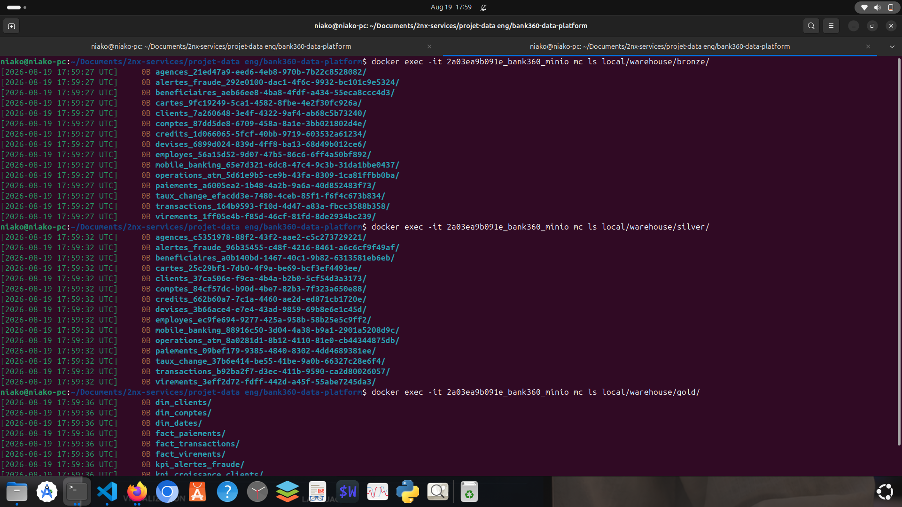

<p align="center">

# 🏦 BANK360

### Plateforme moderne de Data Engineering pour l'analyse bancaire

</p>

<p align="center">


</p>

<p align="center">

### Prévu


</p>

---

## Vue d'ensemble

**BANK360** est un projet de Data Engineering de bout en bout conçu pour simuler l'architecture d'une plateforme moderne de données bancaires.

L'objectif est de transformer des données bancaires opérationnelles en jeux de données fiables, structurés et prêts pour l'analyse à travers une **architecture Lakehouse Medallion**, combinant un **pipeline Batch actuellement opérationnel** avec un futur **pipeline Real-Time Streaming**.

L'implémentation actuelle couvre l'ensemble du flux **Batch Data Engineering**, de PostgreSQL jusqu'à la couche Gold du Lakehouse. L'architecture Streaming, basée sur Apache Kafka et Spark Structured Streaming, constitue la prochaine étape prévue de la plateforme.


### État actuel de l'implémentation

| Composant                         | État     |
| --------------------------------- | -------- |
| Infrastructure                    | Terminé  |
| Génération des données PostgreSQL | Terminé  |
| PostgreSQL → Bronze               | Terminé  |
| Bronze → Silver                   | Terminé  |
| Silver → Gold                     | Terminé  |
| Modélisation dbt                  | Terminé  |
| Orchestration Airflow             | Terminé  |
| Dashboard Streamlit               | En cours |
| Data Quality                      | Prévu    |
| Kafka Streaming                   | Prévu    |
| Spark Structured Streaming        | Prévu    |
| Détection de fraude en temps réel | Prévu    |
| Snowflake                         | Prévu    |
| Monitoring                        | Prévu    |

---

# Objectifs du projet

BANK360 a été conçu autour de plusieurs problématiques réelles du Data Engineering :

* ingérer des données provenant d'une base de données OLTP ;
* construire un Data Lakehouse structuré ;
* séparer les données brutes, nettoyées et analytiques ;
* traiter les données avec Apache Spark ;
* gérer les tables avec Apache Iceberg ;
* orchestrer les pipelines avec Apache Airflow ;
* modéliser les données analytiques avec dbt ;
* exposer les indicateurs métier à travers un dashboard ;
* préparer l'architecture à une future gestion des données en temps réel.

L'objectif final est de faire évoluer BANK360 vers une **plateforme hybride Batch + Real-Time**.

---

# Architecture actuelle

La version actuelle de BANK360 se concentre sur la **plateforme Batch**.


### Décision architecturale importante

**PostgreSQL est uniquement utilisé comme système OLTP source.**

Les couches Bronze, Silver et Gold sont stockées dans :

> **MinIO + Apache Iceberg**

La couche Gold n'est donc **pas réécrite dans PostgreSQL**.

Cette séparation permet à la plateforme analytique de rester indépendante de la base de données opérationnelle.

---

# Source de données — PostgreSQL

La plateforme commence par une base de données bancaire OLTP simulée avec PostgreSQL.

Un générateur de données Python utilisant **Faker** a été développé afin de produire des données bancaires synthétiques réalistes.

Le jeu de données actuel contient environ :

> **150 000+ enregistrements répartis sur 15 tables bancaires**

### Principales entités

| Table            | Enregistrements |
| ---------------- | --------------: |
| `clients`        |           5 000 |
| `comptes`        |          10 034 |
| `transactions`   |          95 000 |
| `paiements`      |          15 000 |
| `virements`      |          10 000 |
| `mobile_banking` |          12 000 |
| `operations_atm` |           8 000 |
| `cartes`         |           6 030 |
| `beneficiaires`  |           2 000 |
| `alertes_fraude` |             500 |
| `credits`        |           1 000 |
| `agences`        |               8 |
| `employes`       |               3 |
| `devises`        |               5 |
| `taux_change`    |               4 |

### Stack de génération des données

```text
Python
  │
  ├── Faker
  ├── Business Rules
  └── Synthetic Data Generation
          │
          ▼
      PostgreSQL
```

Toutes les données utilisées dans ce projet sont **synthétiques**.

Aucune donnée bancaire ou donnée client réelle n'est utilisée.

---

# Couche Bronze — Données brutes

La première couche du Lakehouse reçoit les données extraites depuis PostgreSQL.

Le processus d'ingestion est implémenté avec :

* Apache Spark
* PostgreSQL JDBC
* Apache Iceberg
* MinIO / S3

### Pipeline

```text
PostgreSQL
     │
     │ JDBC
     ▼
Apache Spark
     │
     ▼
MinIO
     │
     ▼
Apache Iceberg
     │
     ▼
BRONZE
```

La couche Bronze conserve les données provenant de la source tout en les transférant vers le Data Lakehouse.

### Caractéristiques de la couche Bronze

* 15 tables
* ~150 000+ enregistrements
* données sources brutes
* tables Iceberg
* stockage objet MinIO

---

# Couche Silver — Données nettoyées

La couche Silver contient les jeux de données nettoyés et validés.

Les transformations sont réalisées avec **Apache Spark**.

### Principales règles de qualité des données

#### Clients

```text
email doit être unique
age > 18
```

#### Comptes

```text
balance >= -authorized_overdraft
```

#### Transactions

```text
amount > 0
canal de transaction valide
```

#### Cartes

```text
expiration_date > current_date
```

Les traitements comprennent également :

* suppression des doublons ;
* gestion des valeurs NULL ;
* validation des données ;
* validation des règles métier ;
* contrôle de la cohérence des schémas.

### Pipeline

```text
BRONZE
   │
   │ Apache Spark
   ▼
SILVER
```

La couche Silver contient actuellement :

> **15 tables et environ 150 000+ enregistrements**

---

# Couche Gold — Données prêtes pour l'analyse

La couche Gold constitue la couche analytique de la plateforme.

Elle transforme les données nettoyées de Silver en modèles orientés métier pouvant être consommés par les applications analytiques.

La transformation est réalisée avec **dbt**.

```text
Silver
   │
   │ dbt
   ▼
Gold
```

### Dimensions

* `dim_clients`
* `dim_comptes`
* `dim_dates`

### Tables de faits

* `fact_transactions`
* `fact_paiements`
* `fact_virements`

### Modèles KPI

* `kpi_revenus_mensuels`
* `kpi_croissance_clients`
* `kpi_alertes_fraude`

### Volumes Gold

| Modèle                   | Enregistrements |
| ------------------------ | --------------: |
| `dim_clients`            |           5 000 |
| `dim_comptes`            |          10 010 |
| `fact_transactions`      |          58 659 |
| `fact_paiements`         |          15 000 |
| `fact_virements`         |          10 000 |
| `kpi_alertes_fraude`     |             254 |
| `kpi_croissance_clients` |              61 |
| `kpi_revenus_mensuels`   |               7 |

La couche Gold contient **9 modèles analytiques** : 3 dimensions, 3 tables de faits et 3 modèles KPI.

### Implémentation dbt

Les modèles Gold sont générés avec dbt et exposés via l'environnement Spark SQL avant d'être persistés dans le Lakehouse Iceberg/MinIO.


---

# Data Lakehouse — MinIO + Apache Iceberg

BANK360 utilise **MinIO comme stockage objet compatible S3** et **Apache Iceberg comme format de table**.

Cette combinaison constitue le socle du Lakehouse.

```text
                    MINIO
              Stockage compatible S3
                       │
        ┌──────────────┼──────────────┐
        ▼              ▼              ▼
     BRONZE          SILVER          GOLD
        │              │              │
        └──────────────┼──────────────┘
                       │
                 Apache Iceberg
```

### Pourquoi Iceberg ?

Apache Iceberg fournit une abstraction de table adaptée aux charges analytiques tout en permettant de maintenir des tables structurées sur du stockage objet.

### Pourquoi MinIO ?

MinIO fournit une couche de stockage objet compatible S3 permettant de reproduire localement une architecture de Data Lakehouse inspirée des environnements Cloud.

### Structure actuelle du Lakehouse

```text
warehouse/
│
├── bronze/
│
├── silver/
│
└── gold/
```

### Stockage MinIO



---

# Orchestration du pipeline — Apache Airflow

L'ensemble du pipeline Batch est orchestré avec Apache Airflow.

Le DAG est nommé :

```text
bank360_pipeline
```

### Workflow du DAG

```text
healthcheck_environment
          │
          ▼
ingestion_postgres_to_bronze
          │
          ▼
transformation_bronze_to_silver
          │
          ▼
modeling_silver_to_gold
```

### Planification du pipeline

Le pipeline est configuré pour s'exécuter automatiquement :

> **Chaque nuit à 02:00**

### Responsabilités d'Airflow

Airflow est responsable de :

* la planification ;
* la gestion des dépendances entre les tâches ;
* l'exécution des pipelines ;
* la gestion des échecs ;
* le suivi de l'état des tâches ;
* la coordination des traitements Spark et dbt.


### État actuel

**Pipeline Batch opérationnel**

---

# Couche Analytics — Streamlit

La prochaine étape du projet est le développement d'un dashboard analytique avec **Streamlit**.

Le dashboard consomme les données déjà préparées dans la couche Gold.

```text
                 GOLD
                  │
                  ▼
             Spark SQL
                  │
                  ▼
                JDBC
                  │
                  ▼
             Streamlit
                  │
        ┌─────────┼─────────┐
        ▼         ▼         ▼
       KPIs    Graphiques   Analyse
```

### Indicateurs prévus

Le dashboard est conçu pour exposer notamment :

* nombre total de clients ;
* volume des transactions ;
* évolution des transactions ;
* revenus mensuels ;
* paiements ;
* virements ;
* croissance du nombre de clients ;
* alertes de fraude.

### État actuel

> **Dashboard Streamlit — En cours**

Les données analytiques sont **déjà disponibles dans la couche Gold**.

Le travail actuel porte donc sur la construction de la couche de présentation et d'exploration des données.

---

# Data Quality — Prévu

La prochaine phase consacrée à la qualité des données introduira un framework dédié.

La technologie prévue est :

**Great Expectations**

Les contrôles envisagés comprennent :

```text
✓ Validation du schéma
✓ Gestion des valeurs NULL
✓ Unicité
✓ Types de données
✓ Valeurs autorisées
✓ Intégrité référentielle
✓ Règles métier
✓ Nombre d'enregistrements
✓ Détection d'anomalies
```

### État

**Prévu**

---

# Streaming temps réel — Prévu

La plateforme Batch est volontairement développée séparément de la future architecture Streaming.

La prochaine évolution majeure introduira :

* Apache Kafka ;
* Spark Structured Streaming ;
* traitement des transactions en temps réel ;
* détection de fraude ;
* alertes en temps réel.

### Architecture future

```text
                    REAL-TIME PIPELINE

              Événement de transaction
                         │
                         ▼
                  ┌─────────────┐
                  │    Kafka    │
                  │   Topics    │
                  └──────┬──────┘
                         │
                         ▼
          ┌──────────────────────────┐
          │ Spark Structured         │
          │ Streaming                │
          └────────────┬─────────────┘
                       │
              ┌────────┴────────┐
              ▼                 ▼
       Détection de fraude   KPI temps réel
              │                 │
              └────────┬────────┘
                       ▼
                 Couche Analytics
```

### Topics Kafka prévus

Exemples :

```text
transactions
payments
transfers
atm_operations
fraud_alerts
```

### État

**Streaming non démarré**

Cette phase sera implémentée après la finalisation du dashboard Batch Streamlit.

---

# Choix d'architecture et décisions techniques

L'un des objectifs principaux de BANK360 n'est pas seulement d'utiliser différentes technologies, mais de comprendre **pourquoi chaque technologie intervient à un niveau spécifique de l'architecture**.

### PostgreSQL → OLTP

PostgreSQL représente le système bancaire opérationnel dans lequel les données transactionnelles sont générées et maintenues.

### Spark → Traitement distribué

Apache Spark est utilisé pour les traitements d'ingestion et de transformation des données.

### MinIO → Stockage objet

MinIO fournit une couche de stockage objet compatible S3 pour le Data Lakehouse.

### Iceberg → Format de table

Apache Iceberg fournit des tables analytiques structurées au-dessus du stockage objet.

### Bronze / Silver / Gold → Organisation des données

L'architecture Medallion sépare :

```text
Brut
 ↓
Nettoyé
 ↓
Prêt pour l'analyse
```

Cette organisation facilite la maintenance et l'évolution du pipeline.

### dbt → Modélisation analytique

dbt est utilisé pour transformer les données Silver en modèles analytiques orientés métier.

### Airflow → Orchestration

Airflow gère la planification et les dépendances entre les différentes étapes du pipeline.

### Streamlit → Consommation analytique

Streamlit fournit une interface légère permettant d'explorer les données de la couche Gold.

### Kafka + Spark Streaming → Future couche temps réel

La stack Streaming sera introduite séparément afin de maintenir une séparation claire entre les responsabilités Batch et Real-Time.

---

# Synthèse du traitement des données

| Couche     | Tables | Enregistrements | Technologie     | État         |
| ---------- | -----: | --------------: | --------------- | ------------ |
| PostgreSQL |     15 |          ~150K+ | PostgreSQL      | Opérationnel |
| Bronze     |     15 |          ~150K+ | Spark + Iceberg | Opérationnel |
| Silver     |     15 |          ~150K+ | Spark + Iceberg | Opérationnel |
| Gold       |      9 |           ~98K+ | dbt + Iceberg   | Opérationnel |
| Streamlit  |      — |               — | Streamlit       | En cours     |

---

# Stack technologique

| Catégorie            | Technologie                | Rôle                                 |
| -------------------- | -------------------------- | ------------------------------------ |
| Programmation        | Python                     | Génération et traitement des données |
| Langage de requête   | SQL                        | Manipulation et analyse des données  |
| Base source          | PostgreSQL                 | OLTP                                 |
| Traitement           | Apache Spark               | Traitement distribué                 |
| Stockage             | MinIO                      | Stockage objet compatible S3         |
| Format de table      | Apache Iceberg             | Tables du Lakehouse                  |
| Transformation       | dbt                        | Modélisation analytique              |
| Orchestration        | Apache Airflow             | Planification et pipelines           |
| Dashboard            | Streamlit                  | Visualisation des données            |
| Conteneurisation     | Docker                     | Infrastructure                       |
| Streaming            | Apache Kafka               | Ingestion événementielle prévue      |
| Traitement Streaming | Spark Structured Streaming | Traitement temps réel prévu          |
| Data Quality         | Great Expectations         | Prévu                                |
| Monitoring           | Prometheus / Grafana       | Prévu                                |

---

# Infrastructure

L'ensemble de l'environnement est conteneurisé avec **Docker / Docker Compose**.

Le projet s'exécute localement sous la forme d'un environnement Data Engineering composé de plusieurs services.

Les principaux services sont :

```text
PostgreSQL
MinIO
Spark
Spark Thrift Server
Airflow
dbt
Streamlit
```

Cette approche rend la plateforme reproductible et permet de développer chaque composant de manière indépendante.

---

# Structure du projet


```text
bank360-data-platform/
│
├── airflow/
│   ├── dags/
│   │   └── bank360_pipeline.py
│   ├── Dockerfile
│   ├── requirements.txt
│   ├── plugins/
│   └── scripts/
│
├── dashboards/
│   ├── powerbi/
│   └── streamlit/
│       ├── app.py
│       ├── pages/
│       ├── Dockerfile
│       └── requirements.txt
│
│
├── data-generator/
│   ├── generate_postgres_data.py
│   ├── README.md
│   └── spark/
│       └── jobs/
│
├── dbt/
│   ├── models/
│   │   ├── staging/
│   │   ├── gold/
│   │   ├── kpis/
│   │   └── sources.yml
│   ├── macros/
│   ├── tests/
│   ├── seeds/
│   ├── dbt_project.yml
│   ├── profiles.yml
│   ├── Dockerfile
│   └── README.md
│
├── fraud/
│   └── README.md
│
├── great_expectations/
│   ├── expectations/
│   ├── checkpoints/
│   ├── validations/
│   ├── build_expectations.py
│   ├── great_expectations.yml
│   └── Dockerfile
│
├── images/
│   ├── architecture.png
│   ├── architeture global prevu.png
│   ├── architecture-termine bash.png
│   ├── basharchiteture.png
│   ├── aiflow succes dags.png
│   ├── dbt succes.png
│   ├── les tables dans MinIO.png
│   ├── MinIoAveclesdonnes.png
│   └── template de dahsbord.png
│
├── ingestion/
│   ├── postgres_to_bronze.py
│   ├── bronze_to_silvers.py
│   ├── SILVER_to_GOLD_AVEC DBT.py
│   └── README.md
│
├── monitoring/
│   ├── grafana/
│   └── README.md
│
├── postgres/
│   ├── init.sql
│   └── README.md
│
├── quality/
│   └── README.md
│
├── scripts/
│   └── init/
│       └── init_postgres.sql
│
├── snowflake/
│   └── README.md
│
├── spark/
│   ├── config/
│   │   ├── hive-schema-3.1.0.postgres.sql
│   │   ├── hive-site.xml
│   │   └── spark-defaults.conf
│   ├── jobs/
│   │   └── batch/
│   ├── jars/
│   ├── Dockerfile
│   └── requirements.txt
│
├── streaming/
│   └── README.md
│
├── docker-compose.yml
├── .env.example
├── .gitignore
└── README.md
```


---

# Feuille de route

## Phase 1 — Fondation

* [x] Infrastructure Docker
* [x] PostgreSQL
* [x] MinIO
* [x] Spark
* [x] Airflow
* [x] Dépôt GitHub

## Phase 2 — Génération des données

* [x] Jeu de données bancaire synthétique
* [x] 15 tables bancaires
* [x] 150 000+ enregistrements

## Phase 3 — Plateforme Data Batch

* [x] PostgreSQL → Bronze
* [x] Bronze → Silver
* [x] Silver → Gold
* [x] Apache Iceberg
* [x] MinIO
* [x] dbt
* [x] Orchestration Airflow

## Phase 4 — Analytics

* [ ] Dashboard Streamlit
* [ ] Pages KPI
* [ ] Analyse des transactions
* [ ] Analyse des clients
* [ ] Analyse des revenus
* [ ] Analyse de la fraude

## Phase 5 — Data Quality

* [ ] Great Expectations
* [ ] Rapports de qualité des données
* [ ] Validation automatisée
* [ ] Quality gates du pipeline

## Phase 6 — Streaming temps réel

* [ ] Kafka
* [ ] Topics Kafka
* [ ] Spark Structured Streaming
* [ ] Traitement des transactions en temps réel
* [ ] Détection de fraude en temps réel
* [ ] Alertes en temps réel

## Phase 7 — Cloud & Production

* [ ] Snowflake
* [ ] Déploiement Cloud
* [ ] Prometheus
* [ ] Grafana
* [ ] Monitoring des pipelines
* [ ] Observabilité

---

# Compétences démontrées

À travers BANK360, les compétences suivantes en Data Engineering sont mises en œuvre :

### Data Engineering

* Ingestion de données
* ETL / ELT
* Traitement Batch
* Transformation des données
* Modélisation des données
* Architecture Data Lakehouse

### Big Data

* Apache Spark
* Apache Iceberg
* Traitement distribué
* Stockage compatible S3

### Data Platform

* MinIO
* PostgreSQL
* Docker
* Docker Compose

### Analytics Engineering

* dbt
* Modélisation dimensionnelle
* Tables de faits
* Tables de dimensions
* Modélisation des KPI

### Orchestration des données

* Apache Airflow
* Conception de DAG
* Planification
* Gestion des dépendances
* Automatisation des pipelines

### Data Visualization

* Streamlit
* Dashboards KPI
* Exploration analytique

### Future Data Engineering temps réel

* Apache Kafka
* Spark Structured Streaming
* Architecture événementielle
* Détection de fraude en temps réel

---

# Qu'est-ce qui distingue BANK360 ?

BANK360 est conçu comme plus qu'un simple projet de visualisation.

Le projet part d'une base de données opérationnelle et construit progressivement une plateforme de données complète :

```text
                DONNÉES MÉTIER
                      │
                      ▼
               PostgreSQL OLTP
                      │
                      ▼
                 INGESTION
                      │
                      ▼
                DATA LAKEHOUSE
                      │
             ┌────────┼────────┐
             ▼        ▼        ▼
          Bronze    Silver    Gold
             │        │        │
             └────────┼────────┘
                      │
                      ▼
                  ANALYTICS
                      │
                      ▼
                  STREAMLIT
                      │
                      ▼
             BUSINESS INSIGHTS
```

L'architecture est également conçue pour évoluer vers :

```text
              BANK360 FUTURE PLATFORM

                  ┌─────────────┐
                  │    Batch    │
                  │  Pipeline   │
                  └──────┬──────┘
                         │
                         ▼
                    Lakehouse
                         ▲
                         │
                  ┌──────┴──────┐
                  │   Real-Time │
                  │   Pipeline  │
                  └─────────────┘
```

Cette évolution permettra à terme à la même plateforme de prendre en charge à la fois les **analyses historiques** et les **cas d'usage bancaires en temps réel**.

---

# 👩🏽‍💻 Auteur

## Niako

**Email :** [kebenaiko17@gmail.com](mailto:kebenaiko17@gmail.com)

**Master 2 — Data Engineering / Intelligence Artificielle**

**Junior Data Engineer | Big Data • Cloud • Data Platforms**

Intéressé par la conception de plateformes de données, le traitement distribué, les architectures Cloud et les pipelines de données temps réel.

### GitHub

**github.com/InnoDataNiako**

---

# État du projet

> **Plateforme Data Batch BANK360 : Opérationnelle**
>
> **Dashboard Analytics : En cours**
>
> **Architecture Streaming temps réel : Prévue**

Le projet évolue progressivement d'une **plateforme Data Batch complète** vers une **plateforme bancaire hybride Batch + Real-Time**.
